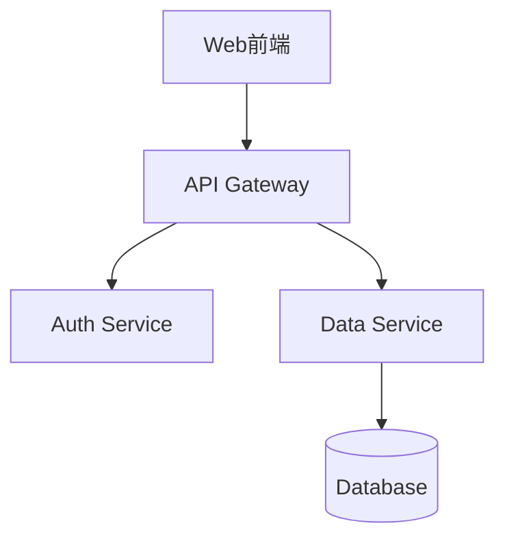

# 自动文档生成 Skill
扫描代码仓库，自动生成文档、README、架构图。

## 使用方式
当用户说 "生成文档"、"写README"、"画架构图"、"API文档"、"项目文档" 时触发。

## 工具
- 代码分析：Glob + Grep + Read 遍历项目
- 架构图：Mermaid.js（文本→图表）
- API 文档：分析函数签名和注释
- README：标准模板 + 项目特征填充

## 能力
1. 自动生成项目 README（包含安装/使用/API 说明）
2. 生成 Mermaid 架构图（目录树/类图/流程图/时序图）
3. 从注释提取 API 文档
4. 生成 CHANGELOG
5. 生成贡献指南
6. 项目结构说明文档
7. 从 Git 历史生成 Release Notes

## 步骤
1. Glob 扫描项目文件结构
2. 识别项目类型（Web/CLI/Library/等）
3. 读取关键文件（package.json/setup.py/go.mod 等）
4. 遍历源代码提取函数/类/接口
5. 用 Mermaid 语法生成架构图
6. 填充文档模板并输出

## Mermaid 示例

